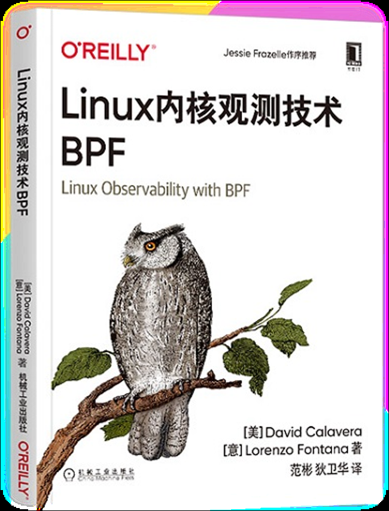

<h1>Ebpf编程入门</h1>


| 日期 | 2022年12月23日 |
| ---- | :------------: |
|      |                |


[TOC]


# 1. 什么是eBPF?

## 1.1 BPF

BPF，全称Berkeley Packet Filter。最初出现在1993公开发表的论文里。通过引入BPF技术，在当时可以把数据包过滤技术性能提升20倍以上，它主要是通过：

- 虚拟机（VM）设计，可以有效的工作在基于寄存器结构的CPU上
- BPF程序在内核层进行高效过滤，避免将数据复制到用户空间进行处理

而VM本身的设计非常简洁：2个32位寄存器A/X, 16个内存位：M[0-15], 33个指令集。

BPF最主要的用途便是进行包过滤（这应该也是名字的由来），最常见的就是tcpdump工具以及libpcap库，过滤器部分便是采用了BPF技术。


1997年合入Linux2.1.75版本，2011年加入了BPF JIT编译器功能。当时BPF主要应用场景有：

- tcpdump格式的报文过滤
- Linux网络流量控制TC，Qos, cls_bpf
- seccomp-bpf沙盒程序系统调用过滤
- netfilter,iptables,xt_bpf

## 1.2  eBPF

eBPF = extended Berkeley Packet Filter。2014年，Alexei Starovoitov实现了eBPF, eBPF最早出现在Linux内核3.18中。从此之后，之前的BPF被称为经典BPF，缩写为cBPF（classic BPF）,目前cBPF已经被eBPF重写， Linux内核只运行eBPF, 内核会自动将加载的CBPF字节码透明的转换成eBPF后再执行。 不过eBPF在Linux官方上仍然被叫做BPF，因此现在说的BPF实际上指的就是eBPF。


目前eBPF已经成为一个通用的执行引擎，应用场景不再局限于网络数据包的过滤，它已经逐步扩展到内核各个子模块中，**在观测、网络和安全等领域被广泛应用，他已经成为内核中最活跃的子系统**。

eBPF相对于cBPF增强的功能如下：

> - 处理器原生指令建模，更加接近底层处理器架构，性能提升4倍
> - 指令集从33个扩展到114个，实现上依然足够简洁
> - 寄存器从2个32位扩展到了11个64位寄存器
> - 引入bpf_call指令和寄存器传参约定，实现零开销内核函数调用
> - 虚拟机的最大占空间512字节，cBPF为16字节
> - 引入了Map结构，用于用户空间和内核空间数据交换
> - 最大指令数初期为4096个，现在已经扩展到10万条；

eBPF的优势有：

> - 稳定：有循环次数和代码路径限制，可以保证程序在固定时间结束
> - 高效：可以通过JIT方式翻译成本地机器码，执行效率高效
> - 安全：验证器会对BPF程序可访问的函数集合、内存地址有严格限制，不会导致内核Panic
> - 热加载/卸载：无需重启内核，可以直接热加载和卸载BPF程序
> - 内核内置：内核直接支持，且提供了稳定的API
> - VM通用引擎足够简洁通用

eBPF的限制有：

> - eBPF程序不能调用任意内核函数，只限于内核提供的BPF辅助函数- 
> - eBPF程序不允许包含无法达到的指令，防止加载无效代码，延迟程序终止
> - eBPF程序中循环次数有限且必须在有限时间内结束，否则无法加载
> - eBPF堆栈被限定为512字节


> eBPF被称为过去50年操作系统的最大的变革！！！


## 1.3 应用场景

目前BPF的三个主要应用领域主要是：网络、安全、可观测性。

- 网络

可编程性和效率的结合使得eBPF自然而然地满足了网络解决方案的所有数据包处理要求。eBPF的可编程性使得其能够在不离开Linux内核的包处理上下文情况下，添加额外的协议分析器，并轻松编程任何转发逻辑以满足不变化的需求。JIT编译器提供的效率使得其执行性能接近于本地编译的内核代码。

- 安全

看到和理解所有系统调用的基础上，将其与所有网络操作的数据包和套接字级视图相结合，可以采用革命性的方法来确保系统的安全。虽然系统调用过滤、网络级过滤和进程上下文跟踪等方面通常有完全独立的系统处理，但eBPF允许将所有方面的可视性和控制结合起来，以创建在更多上下文运行的，具有更好控制水平的安全系统。·

- 可观测性

将ebpf程序附加到跟踪点、以及内核和用户应用探针点的能力，**使得应用程序和系统本身的运行时行为具有前所未有的可见性**。eBPF不依赖于操作系统暴露的静态计数器和测量，而是实现了自定义指标的收集和内核态数据聚合，并基于广泛的可能来源生成可见性事件。

### 1.3.1  网络

> 场景一: 网络数据包过滤

BPF_PROG_TYPE_SOCKET_FILTER类型，用于挂载到网络套接字上，也是最早的BPF使用场景。

> 场景二：TC流量控制


流量控制是一种强大的机制，在所有的分类器中，可以编程网络数据路径cls-bpf分类器。cls-bpf可以将BPF程序直接挂钩到入口和出口层，从而实现对于数据包流入和流出的限制。

流量控制可以参考：[[译] 流量控制（TC）五十年：从基于缓冲队列（Queue）到基于时间（EDT）的演进（Google, 2018）](http://arthurchiao.art/blog/traffic-control-from-queue-to-edt-zh/)

> 场景三：XDP

软件实现高性能包处理的场景，对每个包的处理耗时有着极高的要求。通用目的操作系统中 的网络栈更多是针对灵活性的优化，这意味着它们花在每个包上 的指令太多了，不适合网络高吞吐的场景。

近些年业界流行通过**内核旁路**的方式实现高性能报文转发。实现方式是 将网络硬件完全交由某个专门的用户空间应用接管，从而避免内核和用户态上下文切换的昂贵性能开销。最典型的就是DPDK（完全绕过内核，将网络硬件直接交给用户态的网络应用，并需要独占CPU）。但是，操作系统被旁路之后，它的应用隔离和安全机制就都失效了；一起失效的还有各种经过已经充分测试的配置、部署和管理工具。为解决这个问题，提供了另一种解决方案：**给内核网络栈添加可编程能力**。这使得我们能在兼容各种现有系统、复用已有网络基础设施的前提下，仍然实现高速包处理：eXpress Data Path (XDP)。

- XDP 定义了一个受限的执行环境，运行在一个 eBPF 指令虚拟机中。
- XDP 程序运行在内核上下文中，此时内核自身都还没有接触到包数据，这使得我们能在网卡收到包后 最早能处理包的位置，做一些自定义数据包处理（包括重定向）。
- 内核在加载（load）时执行静态校验，以确保用户提供的 XDP 程序的安全。
- 之后，程序会被动态编译成原生机器指令，以获得高性能。

XDP的系统架构如下：


XDP具有的优点如下：

- XDP 提供了一个**仍然基于操作系统内核**的安全执行环境，在**设备驱动上下文**中执行，可用于定制各种包处理应用。
- XDP 是**主线内核（mainline Linux kernel）的一部分**，与现有的内核网络栈完全兼容，二者协同工作。
- XDP应用通过 C 等高层语言编写，然后编译成特定字节码；出于安全考虑，内核会首先对这些字节码执行静态分析，然后再将它们翻译成 **处理器原生指令**。


XDP支持三种工作模式：

- 原生XDP，默认工作模式，该模式下，XDP BPF程序在网络驱动的早期接受路径之外，需要驱动支持；
- 卸载XDP，XDP的BPF程序直接卸载到网卡，比原生XDP性能要高
- 通用XDP，如果没有原生和卸载XDP功能，可以使用通用XDP。


BPF程序的处理结果：

- XDP_DROP：丢弃数据包
- XDP_TX：转发数据包，将处理后的数据包发回给相同的网卡
- XDP_PASS：将数据包传递到网络协议栈继续处理
- XDP_REDIRECT：与XDP_TX类似，只是转发目的地可以为其他CPU处理队列、不同网卡或者转发到特定的用户空间
- XDP_ABORTED：表示BPF程序处理错误，并丢弃此数据包


XDP常见使用场景：

- 三层路由转发
- 四层负载均衡
- DDOS防护
- 分布式防火墙
- 访问控制ACL

关于XDP详细信息以及与DPDK的对比可参考：[[译] [论文] XDP (eXpress Data Path)：在操作系统内核中实现快速、可编程包处理（ACM，2018）](http://arthurchiao.art/blog/xdp-paper-acm-2018-zh/)

### 1.3.2  安全

Seccomp (Secure Computing), 它是Linux内核中实现的安全层，用于开发人员过滤特定的系统调用，它是基于cBPF实现的。Seccomp过滤基于BPF过滤器，采用SECOMP_MODE_FILTER模式，而系统调用过滤的方式与数据包的过滤方式相同，可以基于系统上下文等对系统调用进行过滤。

### 1.3.3  可观测性

**《BPF之巅·洞悉Linux系统和应用性能》**，此书主要介绍bpf相关工具在观测和跟踪方面的的使用。


- memleak：跟踪内存分配和释放事件对应的调用栈信息，随着时间推移，这个工具可以显示长期不释放的内存。
- execsnoop：监控execve系统调用，对于发现进程的创建和销毁非常有用


# 2. BPF映射

> 映射(MAP)， 主要用于内核空间和用户空间程序之间的通讯。

在BPF编程中，内核空间和用户空间通讯的方式有三种：

- ==bpf_perf_event_output()==：它是通过用户自定义的数据结构，将每一个事件的详细信息发送用户空间的首选方式；
- ==BPF_MAP_TYPE_*以及对应的辅助函数(bpf_map_update_elem)==：映射是键值哈希，可以从中构建更高级的数据结构。映射可以用于摘要统计或者制作直方图，并定期从用户空间读取；
- ==bpf_printk()、bpf_trace_printk()==：仅用于调试使用，它会将结果输出到trace_pipe文件中(详细路径为：/sys/kernel/debug/tracing/trace_pipe)


**BPF编程时，C语言是受限的：没有循环和内核函数调用。**只能使用bpf_* 类的内核辅助函数以及一些编译器内置的函数，这类内核辅助函数定义在bpf_helper_defs.h文件中。

**内核态的BPF程序内，所有的内存访问(除了bpf栈内存外)，都必须通过bpf_probe_read() 函数读取**。除此之外，内存中的数据只能被读到BPF栈或者BPF映射表，而BPF栈空间有限，仅为512字节；如果需要比较大的内存空间，可以使用BPF映射来存储数据。

下面介绍上述通讯方式涉及到的Map类型，以及对应的辅助操作函数。

BPF映射以键值的方式存储在内核中，可以被任何BPF程序进行访问。用户态程序和内核态BPF程序不同的是：BPF程序可以直接访问内核中的数据结构，**而用户态程序需要通过文件描述符访问映射**。BPF映射可以保存实现指定大小的任何类型的数据。


## 2.1 创建映射

### 2.1.1 bpf系统调用

创建BPF映射最直接的方式便是通过bpf系统调用。如果该系统调用的第一个参数设置为BPF_MAP_CREATE,则表示创建一个新的映射，且该系统调用返回与创建映射相关的文件描述符。BPF系统调用的第二个参数为BPF映射的设置，如下所示：


除此之外，为了更加方便使用，内核人员针对bpf系统调用做了再次封装：**bpf_map_create()**。 通过使用该函数，可以在不清楚映射类型的情况下直接创建map结构：

```
map_fd = bpf_map_create(BPF_MAP_TYPE_HASH, NULL, sizeof(uint32_t), 
                                  sizeof(struct stats), 100, NULL);
```


### 2.1.2  使用ELF约定创建映射

内核提供了一些约定和帮助函数，用于生成和使用BPF映射。使用这些约定比直接使用系统调用更加常用，因为约定的方式更具有可读性、更易于遵循。不过这些约定的背后，实际上最终也是通过上面的系统调用来创建的映射。**这也是目前采用最多的方式**。它有助于预先对程序使用的映射有更加直观的理解：


使用这种方式可以明显看出：当前映射的类型，以及它的键值类型，还有容量等关键特性。但是：对于刚开始接触BPF的人不友好，也比较难以理解：不清楚映射到底如何创建的。

<b><font color="red">映射定义是在BPF程序中的（运行在内核态的C代码）。在加载BPF程序时，首先会将该C文件编译成ELF目标文件。BPF加载部分通过解析ELF文件中的section来获取到“maps"段下定义的所有的映射，最后通过bpf系统调用创建出对应映射结构。</font></b>

这里需要注意的是：这种方式创建的BPF映射时，并没有显式的涉及文件描述符。==这里内核使用map_data全局变量来保存BPF映射信息。这个变量数据结构里，按照程序指定的顺序进行存储。== 实际上，在bpf的用户态进程中，在使用bpf（）系统调用创建Map时，系统调用的返回值便是内核分配的文件描述符。


> ELF创建MAP结构的原理！！！

使用ELF约定的方式创建MAP结构的关键在于SEC函数，它的原型如下：


**SEC宏告诉内核该结构是BPF映射类型，需要创建相应的映射。**  

下面对这部分做一个详细的说明：

BPF程序通常情况下是由两部分组成：用户态BPF程序、内核态BPF程序。 用户态BPF程序负责将编译成目标文件(.o)的内核态程序解析，验证后添加到内核中；添加到内核中的除了bpf程序，也包括定义的.map段下的数据结构。 内核态的bpf程序则主要负责实现业务逻辑，将收集到数据信息通过预先定义好的数据结构传递给用户态BPF程序，供用户态进一步分析处理。


下图则是对上文中的编译和加载的进一步说明：


在上述流程中有一个非常关键的流程：**BPF目标文件的解析和加载**。它是整个流程的前提，也是关键，下图便是追踪Linux内核源码中的示例程序整理出的框架。


映射创建完毕后，便可以在内核和用户空间进行数据传输。下面介绍下：<b><font color="red">如何使用映射结构？</font></b>


## 2.2 使用映射

从上文中已经知道：BPF的MAP映射是创建在内核中。  对于内核态的BPF程序，可以直接访问；但是对于用户态的BPF程序需要使用文件描述符进行访问。因此用户态和内核态使用的函数并不相同，**下面主要介绍内核态的操作函数，因为它是通用的，都是用C编写的；用户态的函数根据选择的编程语言有所不同**，这里不做介绍。

**以下介绍的函数都定义在bpf/bpf_helper_defs.h头文件中**；使用时一般通过`#include "common.h"`便可以使用这部分内核函数。用户空间的程序则通过tools/lib/bpf/bpf.h头文件进行加载。


###	2.2.1 添加/更新

创建映射之后，可能要做的第一件事便是保存数据内容。内核提供了帮助函数bpf_map_update_elem来实现此功能。它的定义如下：


内核中的bpf_map_update_elem函数有四个参数，字段含义如下：

其中：

- map：指向要更新的映射的指针；
- key：指向更新的键的指针；
- value：我们要更新的值的指针;
- flags：更新方式；有三种取值，参见下文
- 返回值：
  - 成功：返回key对应的键的指针
  - 失败：返回NULL


从函数原型可以看出：**map,key,value均使用的`void *`类型， 因此我们可以传递任意类型的映射、键值对等**。关于flags，它的取值有：

- **BPF_NOEXIST** : 仅在不存在key时, 创建元素.
- **BPF_EXIST** : 仅在存在key时, 更新元素.  
- **BPF_ANY** : 不存在key时, 创建元素; 存在key时, 更新元素.

以上三种flag并不是所有的Map类型都支持。例如：BPF_MAP_TYPE_ARRAY, BPF_MAP_TYPE_PERCPU_ARRAY类型便不支持BPF_NOEXIST，因为数组中的元素是一直存在的，没法动态变化。

举个例子：<b><font color="red">使用哈希Map统计不同进程调用accept函数的次数：</font></b>


###	2.2.2 查找

内核态提供的查找函数原型如下：


其中：

- map：表示要查找的映射Map地址；
- key：表示要查找的键值地址；
- 返回值：
  - 成功：返回key对应的键的指针
  - 失败：返回NULL


### 2.2.3 删除

内核态提供的删除函数原型如下：


其中：

- map：表示要删除的映射Map地址；
- key：表示要删除的键值地址；
- 返回值：
  - 成功：0
  - 失败：负值


###	2.2.4 并发访问操作

为了防止竞态访问问题，BPF引入了bpf自旋锁的概念。可以在操作元素的时候对访问的映射元素进行锁定。内核提供的操作函数为：


自旋锁的使用限制条件非常的多(bpf_helper_defs.h)：

- 自旋锁仅使用于BPF_MAP_TYPE_HASH、BPF_MAP_TYPE_ARRAY类型的映射中(未来可能会扩展)。
- BTF描述是必须的
- BPF程序每次最多能同时持有一把锁，因为持有多个可能导致死锁
- 每一个元素只允许有一个struct bpf_spin_lock结构成员
- 当持有自旋锁时，BPF函数间调用功能被禁止
- BPF_LD_ABS，BPF_LD_IND 该指令不允许在临界区内使用
- BPF程序必须在所有可能返回的路径上调用bpf_spin_unlock函数释放自旋锁
- BPF程序只能通过bpf_spin_lock, bpf_spin_unlock函数访问自旋锁；无法通过其他方式访问
- 必须在Map结构的最外层包含“bpf_spin_lock”结构的成员才能使用这两个help函数；即使某一个成员的内部仍然后自旋锁，也不能使用这两个函数
- 系统调用BPF_MAP_LOOKUP_ELEM不会将bpf_spin_lock字段拷贝到用户空间
- 系统调用BPF_MAP_UPDATE_ELEM不会更新Map中的bpf_spin_lock字段
- bpf_spin_lock 不能用在BPF栈上，以及网络数据包中(自旋锁只能用在Map结构里)
- 只有root权限才能使用自旋锁
- 自旋锁不能用在追踪程序(Tracing)、套接字过滤程序中
- 自旋锁不能用在map-in-map的映射类型中


## 2.3 映射类型

在bpf中，数据结构主要是采用**MAP结构(又称为映射)**。它既可以用于用户态和内核态进行通讯，也可以用来作为BPF栈的补充(BPF栈大小限定为512字节，当需要的空间超过512字节时，可以通过MAP映射的方式来代替)。MAP结构的定义如下：


其中各字段的作用参见下表：

| 字段        | 作用                             |
| ----------- | -------------------------------- |
| type        | 映射类型。取值参见“映射类型”定义 |
| key_size    | MAP使用的索引类型大小            |
| value_size  | MAP存在的结构大小                |
| max_entriex | MAP元素的个数                    |
| map_flags   |                                  |

**“映射类型”**定义如下：


下面对其中的最基本的、最常见的MAP进行介绍。


### 2.3.1 哈希表映射

**哈希表映射是添加到内核中的第一种通用映射。映射类型定义为：BPF_MAP_TYPE_HASH。**

他们与我们常用的哈希表在实现和用法上比较相似。**该映射可以使用任意大小的键和值**，内核会按需分配和释放他们，当在哈希表上使用bpf_map_update_elem时，内核会自动更新元素。

哈希表映射经过了优化，即使采用比较复杂的键时，仍然可以高效的进行查找。例如上图中，可以直接将key定义为结构体，然后使用结构体进行快速查找，也已经与常用的MAP几乎一样。

- 定义demo如下：


###	2.3.2 数组映射

**数组映射是添加到内核中的第二种映射。它的映射类型为：BPF_MAP_TYPE_ARRAY。**在对数组映射继续初始化的时候，将预分配的内存均置零。 

**数组映射存在一个缺点：不能删除映射中的元素，无法使数组变小。**如果对该类型的映射尝试进行删除操作(`bpf_map_delete_elem`)，则会返回错误。 它通常用来保存值可能会更新的信息，但是行为通常固定不变。例如我们经常使用数据映射来存储预分配的全局变量。由于它无法删除元素，总是可以在同一个位置访问到同一个元素。

需要注意的一点是：它类似于哈希映射，使用bpf_map_update_elem不是原子性的。如果程序执行更新操作，程序在相同的时间从相同的位置读取数据，可能获取到不同的值。如果将计数器保存在数组映射中，可以使用内核提供的__sync_fetch_and_add来对映射的值进行原子性的操作。其他的场景需要使用自旋锁来保证数据的同步。

- 定义demo如下：


###	2.3.3 PERF EVENT

这种类型映射将perf_event数据存储到环形缓冲区中，**用于BPF程序和用户空间程序进行实时通讯**。**映射类型定义为：BPF_MAP_TYPE_PERF_EVENT_ARRAY。**它可以将内核跟踪工具发出的事件转发到用户空间，一边做进一步的处理。它是一个非常有用的映射一直，也是很多可观测性工具的基础。通过这种类型映射，用户空间程序充当监听器来监听内核事件。

<b><font color="red">在内核态，使用bpf_perf_event_output函数将数据附加到映射上。</font></b>由于映射是BPF程序和用户空间程序之间的实时缓存，所以 不必担心映射元素中的键值。内核负责将新元素添加到映射上，用户空间程序负责将数据进行处理刷新。

- demo如下：


### 2.3.5 Per-CPU哈希映射

**该类型的映射是对BPF_MAP_TYPE_HASH的改进版本。映射类型定义为：BPF_MAP_TYPE_PERCPU_HASH。**我们可以给该类型映射分配CPU，那么每一个CPU都会看到各自独立的版本，这对于高性能的查找和聚合非常有效。

### 2.3.6 Per-CPU数组映射

**该类型的映射是对BPF_MAP_TYPE_ARRAY的改进版本。映射类型定义为：BPF_MAP_TYPE_PERCPU_ARRAY。** 它的优点类似于per-cpu哈希映射。


### 2.3.7 栈跟踪类型

**这种类型映射保存运行进程的栈跟踪信息。映射类型定义为：BPF_MAP_TYPE_STACK_TRACE。**内核中提供了帮助函数bpf_get_stackid()用于将栈跟踪信息写入到该映射。该帮助函数还可以设置标记，以便于可以指定仅跟踪内核栈或者用户栈信息，或者是两个栈同时跟踪。

- 扩展：
  - 统计内存的申请和释放栈, 用于定于oom, double-free等内存问题(开源bpf工具：memleak)


###	3.3.8 其他类型

参见《Linux内核观测技术BPF》


## 2.4 内核辅助函数

这类内核辅助函数定义在bpf_helper_defs.h文件中。这其中已经包含了上文介绍的有关map操作的增删改查等函数。


# 3. BPF跟踪点

probe, 追踪点，有的也叫做探针。BPF程序只有附加到这些追踪点之上，才能正常工作。目前追踪点主要分为四类：

- kprobes/kretprobes
- uprobes/uretprobes
- tracepoints
- perf_events

下面对这四类分别进行说明。

## 3.1 kprobes/kretprobes

有的称之为内核探针，内核动态追踪点。==它几乎可以在任何内核指令上设置动态的标记==，当内核达到这些标志时，附加到这部分探针上的代码将会被执行，执行完毕后，内核将恢复正常的模式运行。内核探针可以提供系统中发生的事件信息，例如系统中打开的文件或者正在执行的文件。但是需要注意的是：内核探针没有提供稳定的程序接口，他可能会随着内核版本的迭代而更改。同一个探针附加到两个不同版本的内核系统上，可能出现一个正常工作一个无法正常工作的情形。

kprobes允许在执行任何内核指令之前插入BPF程序。在插入之前需要知道插入点的函数名称，因为此类函数接口并不是稳定的，可能随着版本的不同而变化，因此使用此类追踪点时需要特别注意。当内核运行至设置探针的指令时，它将从代码执行处运行BPF程序，程序执行完毕后再返回插入点继续执行。

kretprobes是在内核指令有返回值是插入BPF程序。通常的情况是：在BPF程序中同时使用kprobes和kretprobes程序，以便获取更全面的信息。

##	3.2 tracepoints

又称之为静态追踪点。静态追踪点与kprobes的主要区别在于：**静态追踪点由内核开发人员在内核中编写和修改**。他们能够保证旧版本上的追踪点在新版本的内核上依然存在，而不必像kprobes那样担心接口发生变更，甚至直接消失的情况。但是呢，由于静态追踪点是由内核开发人员添加的，主要是为了安全和稳定，不会覆盖到所有的内核子系统，因此在覆盖面上不如动态主动点广泛。

可以通过`/sys/kernel/debug/tracing/events/`目录下的内容查看系统中所有的可用的追踪点。此外亦可以通过bpftrace等工具查看当前支持的静态追踪点


##	3.3 uprobes/uretprobes

又称为用户空间探针，它允许在用户空间运行的程序上设置标志。它类似于内核探针，不同的是：监控的用户空间的程序。当我们定义uprobe时，内核会在附件的指令上创建陷阱。当程序执行到该指令时，内核将触发事件一回调函数的方式调用注册的探针函数。==uprobes也可以访问程序链接到的任何库，只要知道对应的指令名称，就可以追踪对应的调用==。


## 3.4 用户态静态追踪点

  


# 4. BTF

编写BPF程序有一个非常重要的问题：**缺少被跟踪程序的源代码信息**。如果缺少源码信息，编写BPF程序将会非常的苦难。

<b><font color="00868B">这个“缺少被跟踪程序的源代码信息”，并不是说对源代码不熟，去看看源码就能解决的问题。</font></b> 

BTF（BPF Type Format, BPF类型格式）是一个元数据的格式，用来将BPF程序的源代码信息编码到调试信息中去。调试信息包括了BPF程序、映射结构等很多其他信息。BTF最初的目的只是为了描述数据类型；不过后来，它还可以包括函数的信息，源代码和行信息，以及全局变量等。现在，BTF已经成为一个通用的、用来描述所有内核数据结构的格式。

比如在编写BPF程序时，想跟踪accept函数的执行情况，这便需要明确sys_enter_accept4的函数格式。它便可以通过查看btf格式的文档(/sys/kernel/debug/tracing/events/syscalls/sys_enter_accept4/format)来获取：


BPF程序还存在一个部署的问题：不同的部署环境，可能采用不用的内核(获取其他依赖程序)版本，这个时候预先编译的BPF程序通常是不能直接部署的。这就是经常提到的CO-RE（Compile Once  Run Everywhere, 一次编译到处执行）需求，目前这个问题的解决便依赖于BTF信息。

> CO- RE:

- https://www.ebpf.top/post/bpf_core/
- https://www.ebpf.top/post/bcc-to-libbpf-guid/
- 


# 5. BPF编程


## 5.1  编译相关


###	5.1.1 gcc,clang,llvm

**LLVM**是Low Level Virtual Machine的简称。这个库提供了与编译器相关的支持，能够进行程序语言的编译期优化、链接优化、在线编译优化、代码生成。可以作为多种语言编译器的后台来使用。

**Clang**是一个C++编写的基于LLVM、发布于LLVM BSD许可证下的C／C++／Object-C／Object-C++ 编译器。

**GCC**：（GNU Compiler  Collection）缩写，一个编程语言编译器，是GNU（自由软件理事会）的关键部分。GCC常被认为是夸平台编译器的事实标准，特别是它的C语言编译器。GCC原本只能处理C语言。但是面对Clang的竞争，很快作出了扩展，现在已经可以处理C++，Fortran、Pascal、Object-C、Java、Ada，以及Go语言。

LLVM是编译器的工具链的集合，Clang是使用LLVM的编译器，Clang必须调用连接器LLDB来产生可执行文件。


### 	5.1.2 go bpf库

前端开发，bpf库的选择和对比：https://www.ebpf.top/post/ebpf_go/

目前在使用go语言的BPF开发中，有两个库使用的比较多：[`cilium/ebpf`](https://github.com/cilium/ebpf) , [`iovisor/gobpf`](https://github.com/iovisor/gobpf)。


cilium/ebpf库是Cilium项目的一个子项目。使用纯Go 语言编写的库，提供了加载、编译和调试 eBPF 程序的功能。它具有最小的外部依赖性，适合在长期运行的进程中使用。该库提供的 `cmd/bpf2go` 工具允许在 Go 代码中编译和嵌入 eBPF 程序，并且可以**通过 go 语言注解来自动进行 eBPF 代码的编译**。


 iovisor/gobpf项目为著名 eBPF 项目 [BCC](https://github.com/iovisor/gobpf) 的一个子项目。该库提供了 bcc 框架的 Go 语言绑定(cgo)，可以在底层使用 `.elf` 格式文件加载和调试 eBPF 程序，底层依赖于 [`libbcc`](https://github.com/iovisor/bcc/blob/master/INSTALL.md) 库。==该库提供了比较强大的重写功能，允许运行时再编译bpf程序，这种方式对于解决版本兼容性方便有一定优势==。


除了上述两种常用的库之外，还有一个更高层的库有可能会接触到：[bpf-manager](https://github.com/ehids/ebpfmanager)。基于cilium/ebpf实现的ebpf类库封装，相比`cilium/ebpf`实现配置化，自动加载，更具备面向对象思想，且实现了`probe`颗粒的卡开启关闭功能。==其中Ecapture项目便使用该库==。


## 5.2 抓取HTTP服务内容

在编写测试用例时，使用了cilimu/ebpf库。原因有两个：1）在易用的同时基本保留了ebpf的痕迹，对于学习bpf比较友好；2）引流插件(mizu开源项目）中也使用了该库，方便学习引流插件的实现。

下面开始介绍相关实现原理。

**提供以下示例的目标有：**

- 了解bpf编程的框架

  - 常用的数据结构及操作函数
  - 追踪函数
  - 其他部分细节

- 了解cilium/ebpf的基本用法

  


示例程序的构成如下：

- 用户态程序（go编写）
  - 1）加载内核态程序；
  - 2）处理内核态程序发送的数据
- 内核态程序（c编写）
  - hook 特定的系统调用，收集数据，发送到用户态程序
- Makefile
  - 用来编译内核态程序和用户态程序


### 5.2.1 HTTP服务器

使用任意一个http服务器即可，这里为了测试方便，实现了一个最简单的http服务器：


直接编译运行即可。


###	5.2.2 内核态逻辑

编写bpf程序，首先需要明确需要实现的功能，然后去确认需要Hook的用户态或者内核态函数；函数确定完毕后，需要确定每个函数的上下文信息，根据上下文信息定义函数的参数结构体；最后根据实际的需求确定采用的数据结构。

> 第一步： 根据需求确认追踪点

这个示例的目的是为了获取http的请求和响应信息。为了获取这部分信息，需要知道一次HTTP请求的处理涉及到哪些系统调用，这里有一个工具可以满足类似的需求：strace。它可以获取程序的调用栈信息，用法如下：

```
strace -f -o syscall.txt go run main.go
```

它会将上面的http服务(main.go)运行过程中的调用栈信息全部获取到，并存储到syscall.txt文件中(文件比较大)。获取后的文件筛选后的信息如下：


从上面的追踪栈信息可以找到，涉及的函数有：

- accept4:  TCP三次握手的系统调用
- read：   读取收到的信息
- write：   写回发送的消息
- close：  TCP四次挥手的系统调用

然后通过bpftrace查看当前的追踪点中有哪些可能是这些函数的hook点：


他们各自对应的hook点为：

| 系统调用 | 追踪点（enter）   | 追踪点（exit）   |
| -------- | ----------------- | ---------------- |
| accept4  | sys_enter_accept4 | sys_exit_accept4 |
| read     | sys_enter_read    | sys_exit_read    |
| write    | sys_enter_write   | sys_exit_write   |
| close    | sys_enter_close   | sys_exit_close   |


> 第二步：明确追踪点上下文信息

确认完毕追踪点之后，便需要每一个追踪点函数的上下文信息(ctx)，这个信息内核直接提供了对应函数的BTF信息，通过BTF信息，我们可以知道每一个函数的ctx结构。

sys_enter_accept4的函数参数如下：

```
struct sys_enter_accept4_ctx {
	__u64 __unused_syscall_header;
	__u32 __unused_syscall_nr;
	
	__u64 fd;
	__u64* sockaddr;
	__u64* addrlen;
    __u64  flags;
};
```


sys_enter_read的函数参数如下：

```
struct sys_enter_read_ctx {
	__u64 __unused_syscall_header;
	__u32 __unused_syscall_nr;
	
	__u64  fd;
	__u64* buf;
	__u64  buflen;
};
```


sys_enter_write的函数参数如下：

```
struct sys_enter_write_ctx {
	__u64 __unused_syscall_header;
	__u32 __unused_syscall_nr;
	
	__u64  fd;
	__u64* buf;
	__u64  buflen;
};
```

sys_enter_close的函数参数如下：

```
struct sys_enter_close_ctx {
	__u64 __unused_syscall_header;
	__u32 __unused_syscall_nr;
	
	__u64  fd;
};
```


> 第三步：明确采用的数据结构

为了显示常用的数据结构的基本用法，主要介绍一下三种数据结构：

- hash Map
- array Map
- perf-event Map

其中perf-event Map主要用来把http服务器的业务信息发送到用户态程序进行处理；另外两种只是作为示例显示用法


> 第四步：编写内核态代码

在编写之前，还需要做一件事：引用包含一系列内核辅助函数的头文件。内核态目前只能通过这些辅助函数来访问内核中的数据。目前这些函数定义在bpf_helper_defs.h， bpf_helper.h 中，直接将这部分头文件添加到工程中便可以使用。


###	5.2.3 用户态逻辑

用户态的实现主要包括两类功能：

- 内核态bpf程序的编译、解析和加载、绑定
- 与内核态bpf程序通讯

其中BPF程序编译加载等典型工作流是：

1. 用 C 编写 BPF 程序
2. 用 Clang+LLVM 将 C 程序编译成对象文件（ELF）
3. 用户空间 BPF ELF 加载器解析对象文件
4. 加载器通过 `bpf()` 系统调用将解析后的对象文件注入内核
5. 内核验证 BPF 指令，然后对其执行即时编译（JIT），返回程序的一个新文件描述符
6. 利用文件描述符 attach 到内核子系统（例如网络子系统）

##### 5.2.3.1 BPF程序编译


目前使用编译BPF目标文件主要还是Clang+llvm。gcc最初是不支持的。除了编译内核态的代码外，内核和用户态共用的数据结构也可以直接借助cilium提供的bpf2go程序，自动生成用户态需要的函数接口，开发人员只需要关心业务逻辑相关部分实现即可，无需再逐步去解析字节码文件。使用bpf2go工具时，需要将一段注释嵌入到go代码中，然后在编译的时候通过go generate工具来生成对应的go文件。

为了方便编译，编写了一个简单的Makefile文件：

然后直接执行`make generate`便可以生成对应的go程序：

其中.o是对应的字节码程序； .go是自动生成的用来解析、加载以及后续数据处理的接口、数据结构。


##### 5.2.3.2 BPF程序加载


BPF字节码程序的加载比较容易，直接调用上述编译出的.go中的接口便可以加载到内核中：

解析和加载的逻辑都比较类似，下图是引流插件中的部分逻辑：


##### 5.2.3. BPF程序绑定


Map和程序加载到内核后，虽然已经分配了文件描述符，但是还无法直接运行，需要将程序与跟踪点绑定后才能生效。


##### 5.2.3.4  用户态内核态通讯

示例中，数据结构主要使用了以下三种，因此这里只简单介绍下这三种的用法。除了这三种结构外，还有很多其他类型的Map, 这部分用法自行摸索。

- hash Map
- array Map
- perf-event Map

💖hash Map 和 array Map用法：


💖 perf event Map用法：


### 5.2.4 用法

💖demo


# 6. 学习资料

- 《Linux内核观测技术BPF》￥50+ ==适合入门bpf编程，全面==

  

- 《BPF之巅：洞悉Linux系统和应用性能》 ￥100+ ==bpftrace工具的用法==


- BPF官网：https://ebpf.top/
- 深入浅出BPF：https://ebpf.io/
- 优秀的翻译后的BPF文档：http://arthurchiao.art/categories/
- cilimu
- 引流插件(mizu)


